# Exercise 04: Build a User Interface using SAP UI5 for booking space tickets

## Estimated time

30 minutes

## Objective

In this exercise, we will build a User Interface based on SAP UI5 so that users can create a booking from the UI of our app.

This exercise is structured into two parts: <br /><br />
**A.) Import, build and deploy the project into SAP Web IDE <br />
B.) Build the User Interface using SAP Web IDE <br />**

In this exercise, we will import the source code from Git service into SAP Web IDE. In SAP Web IDE, the database artifacts are deployed to SAP DBaaS service(SAP HANA) running on SAP Cloud Platform Cloud Foundry environment.

## Exercise description: 

## Part A: Import, build and deploy the project into SAP Web IDE

1. Switch to the SAP Cloud Platform Cockpit where you have your git repository. Click on Web IDE button as shown to launch SAP WebIDE.


2. You will be prompted to login, enter your credentials and click Log on.


3. The SAP Web IDE opens up where you will be asked to clone the repository. As we have not cloned it yet, click on Clone.

 

4. You will be asked to enter the credentials once again. Enter the User that was provided to you and your password. The authentication in 2nd step is for your SAP WebIDE access, and here this is to authenticate access to your git repository that contains the code. There could be several members cloning and working on a common project repository and this ensures only members within the sub-account are able to clone the repository.

 

5. Now you will be able to see the code that was cloned into your SAP Web IDE workspace.

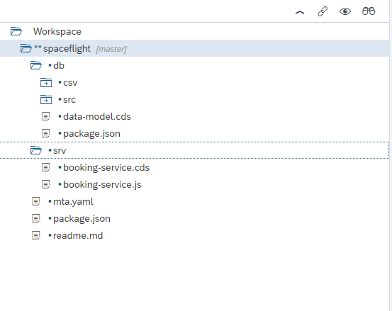

6. Right click on your project and click on project settings. 


7. Choose the Cloud foundry tab and from the list of dropdown options choose the url, "https://api.cf.eu10.hana.ondemand.com".


8. You will be prompted to login. Enter your Cloud Foundry log on credentials: email and password and then your organization and space will be automatically be populated as shown.


9. Open package.json file from the root folder and remove the following lines. These are lines specific to SQLite database that was used locally. Now as we will deploy the database artifacts into SAP HANA, these lines must be removed.
```
"sqlite3": "^4.0.2"                                 // remove line from dependencies
"driver": "sqlite",                                 // remove line from model
"url": "cloud-samples-spaceflight-node.db"          // remove line from model
```
10. Now right click on the db folder of the project and click on Build as shown:

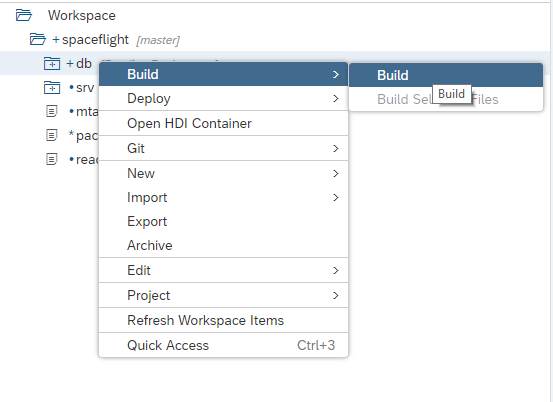

11. The log output can be seen in the console as below. 


12. Goto `Tools` menu on the top -> choose `Preferences` -> click `Features` in the left tabs -> enter `hana` in the search field -> Switch ON the `SAP HANA Database Explorer` as shown:


13. The screen will prompt to Refresh. Click `Refresh`. 


14. After the reload we will have the aditional database explorer tab on the left. Click on this tab and the Database Explorer Connectivity window can be seen as below:


15. Click Connect button in the above image and add a HDI database container. Choose the + button shown below:


16. Choose the HDI Container with the name of your project under the organization `TechEd2018_CNA375-TechEd` and click `OK`.
 
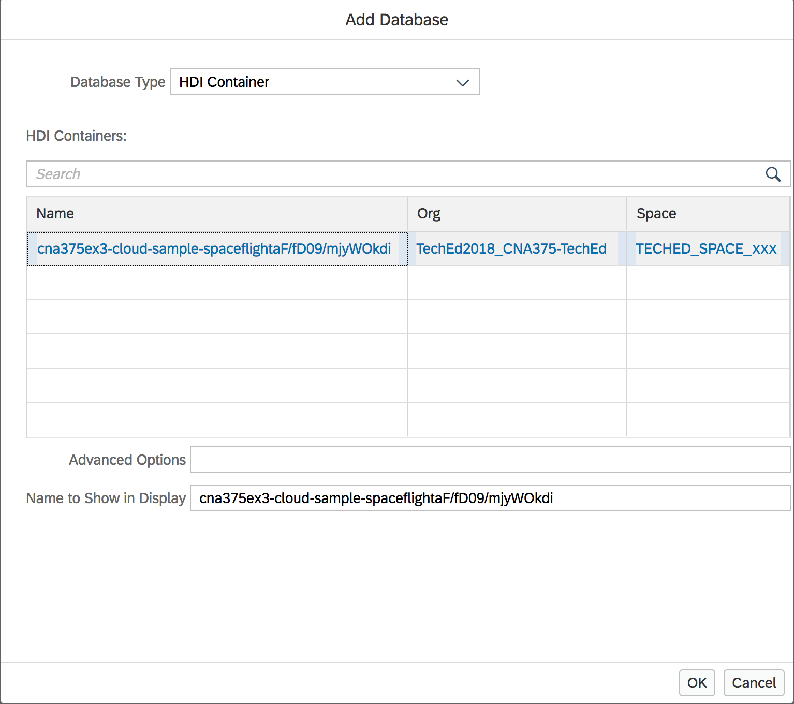

17. Now the database can be seen with the tables as shown:


18. Click on Open Data button to see the content provided from the CSV files into the tables:


19. Open `mta.yml` file from the root folder and change the service-plan of `<project_name>-uaa` from `default` to `application`.
```
  - name: <project_name>-uaa
    type: com.sap.xs.uaa
    parameters:
      service-plan: application
``` 

20. Right click the srv folder and choose `Build` and then choose `Build CDS`. 


The log output can be seen in the console as below. 

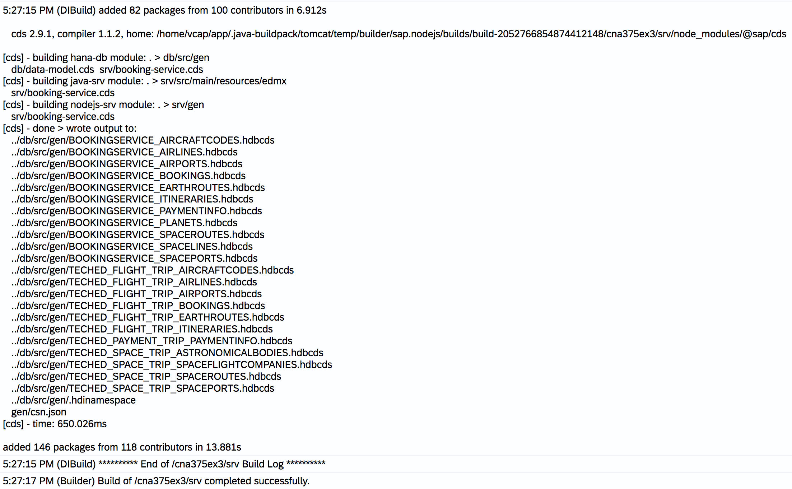

Include the following lines into the `package.json` file present within the `srv` folder
```
  "cds": {
    "data": {
          "driver": "hana",
          "hana": {
                "tag": "hana"
          }
      }
  }  
```

21. Right click the srv folder and choose `Run` and then choose `Run as Node.js Application`. This takes a couple of seconds as it deploys the service to cloud foundry.


The running Node.js application can be seen here. 


On clicking the URL we can see the service information.


Click on the /booking service to access the XML metadata information of the oData service exposed. In addition the URL now is changed to http://<service_URL>/booking/$metadata

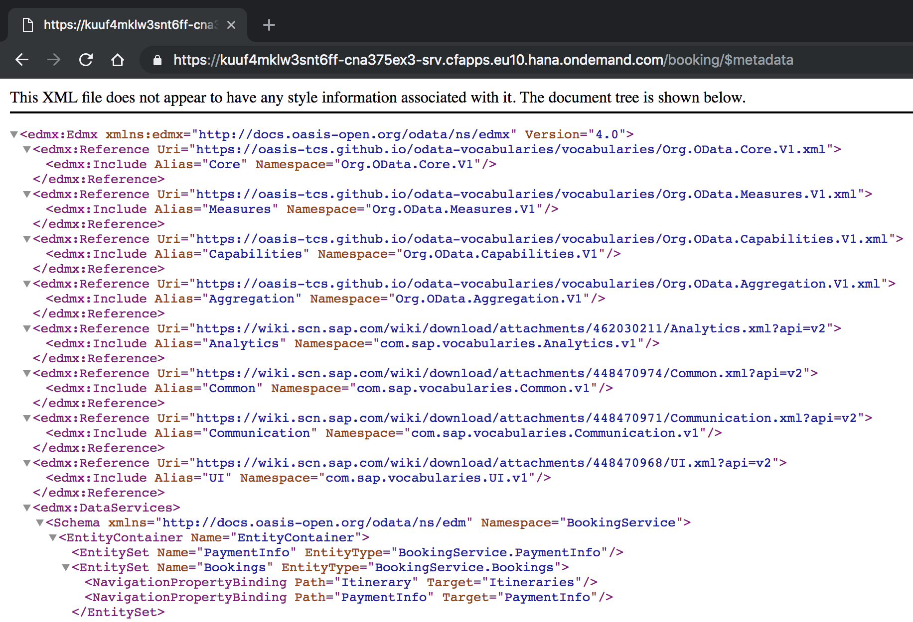

Change the $metadata part of the URL to something meaningful from our exposed service such as Planets to see the JSON response: 

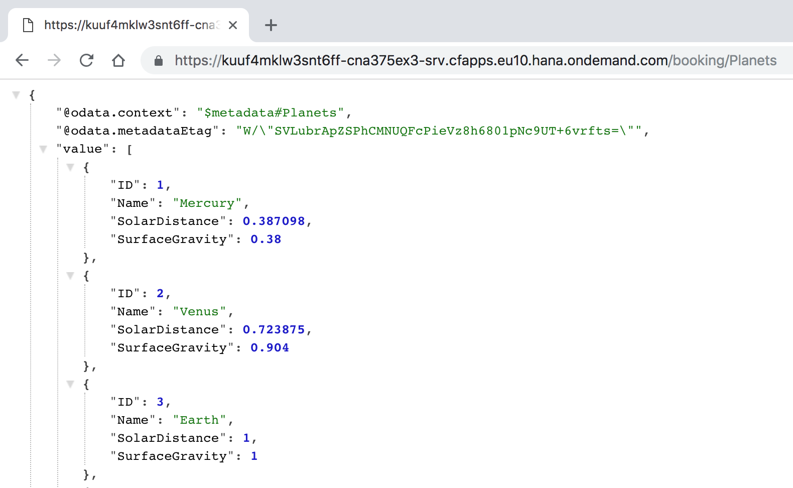

22. Goto [SAP Cloud Platform destinations](https://account.hana.ondemand.com/cockpit#/globalaccount/8fd39023-a237-4d71-9b6a-ed9d1719d275/neosubaccount/06b416a3-9282-4cb7-ae72-e23031b005ca/destinations) to create a destination.

We just imported and built our data model and node service in part A of this exercise.

## Part B: Build the User Interface using SAP Web IDE

1. Right click our project and choose `new` and then `HTML5 module`.


2. Choose the SAPUI5 Application template
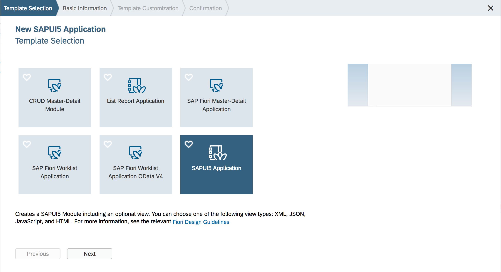

3. Enter Module Name as `ui` and Namespace as `space.itineraries.company`.


4. Give the View Name as App and click on Finish


5. The UI module code is generated. Expand the `ui` folder and then `webapp` folder. Within view and contoller folders you can see two generated files: App.view.xml and App.controller.js


6. Right click on the `view` folder and choose `new` -> `SAPUI5 view`.


7. Give the name as `CreateBooking`, click on `Next` and then `Finish`. Repeat steps 6 to create another SAPUI5 view and this time give the name of the view as `ListBookings`. 
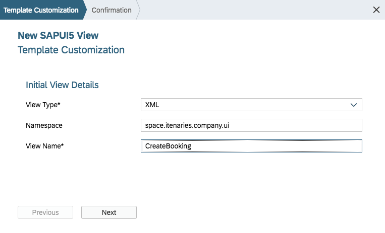
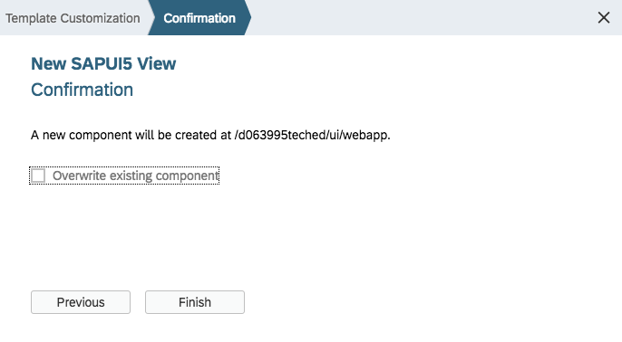

8. Note that 2 additional files for CreateBooking and ListBookings are added under view and controller folders for each respectively.


9. Under view folder, replace the code in `App.view.xml` with the below code:
```
<mvc:View controllerName="space.itineraries.company.ui.controller.App" xmlns:html="http://www.w3.org/1999/xhtml" xmlns:mvc="sap.ui.core.mvc"
	displayBlock="true" xmlns="sap.m">
	<App id="idAppControl">
		<Carousel>
			<pages>
				<Page title="{i18n>appDescription}">
					<mvc:XMLView viewName="space.itineraries.company.ui.view.CreateBooking"/>
				</Page>
				<Page title="{i18n>appDescription}">
					<mvc:XMLView viewName="space.itineraries.company.ui.view.ListBookings"/>
				</Page>
			</pages>
		</Carousel>
	</App>
</mvc:View>
```

10. Replace the code in `CreateBooking.view.xml` with the following code:
```
<mvc:View
  controllerName="space.itineraries.company.ui.controller.CreateBooking"
  xmlns="sap.m"
  xmlns:core="sap.ui.core"
  xmlns:mvc="sap.ui.core.mvc">
  <Panel
	  headerText="{i18n>createBookingPanelTitle}"
	  class="sapUiResponsiveMargin"
		width="auto">
    <VBox class ="sapUiSmallMargin">
      <Label
        text="Name:"
        labelFor="customerNameInput"/>
      <Input
        id="customerNameInput"
        value="{
          path:'newBooking>/CustomerName',
          type:'sap.ui.model.type.String',
          formatOptions: {
            style: 'medium',
            stringParsing: true
          },
          constraints : {
            minLength : 1
          }
        }"
		  	valueLiveUpdate="true"
        required="true"
		  	width="60%"
        class="sapUiSmallMarginBottom"/>
      <Label
        text="Email:"
        labelFor="emailInput"/>
      <Input
        id="emailInput"
        value="{
          path:'newBooking>/EmailAddress',
          type:'sap.ui.model.type.String',
          formatOptions: {
            style: 'medium',
            stringParsing: true
          },
          constraints : {
            search : '\\S+@\\S+\\.\\S+'
          }
        }"
		  	valueLiveUpdate="true"
        required="true"
		  	width="60%"
        class="sapUiSmallMarginBottom"/>
      <Label
			  text="Choose a journey:"
        labelFor="selectedItineraryId"/>
		  <Select
        id = "selectedItineraryId"
			  width="60%"
        class="sapUiSmallMarginBottom"
        items="{
          path: '/Itineraries',
          sorter: { path: 'Name'}
        }">
        <core:Item key="{ID}" text="{Name}"/>
      </Select>
      <Label
        text="Date of travel:"
        labelFor="dateOfTravel"/>
      <DatePicker
        id="dateOfTravel"
        value="{
          path:'newBooking>/DateOfTravel',
          type:'sap.ui.model.type.Date',
          formatOptions: {
            style: 'medium',
            stringParsing: true
          }
        }"
        required="true"
        class="sapUiSmallMarginBottom"
        width="60%"
      />
      <Label
        text="Number of passangers:"
        labelFor="numPassengers"/>
      <Input
        id="numPassengers"
        value="{
          path:'newBooking>/NumberOfPassengers',
          type:'sap.ui.model.type.Integer',
          formatOptions: {
            style: 'medium',
            stringParsing: true
          },
          constraints : {
            minLength : 1
          }
        }"
        required="true"
        width="60%"
        class="sapUiSmallMarginBottom"
      />
      <Label
        text="Credit card number:"
        labelFor="creditCard"/>
      <Input
        id="creditCard"
        value="{
          path:'newBooking>/PaymentInfo_CardNumber',
          type:'sap.ui.model.type.Number',
          formatOptions: {
            style: 'medium',
            stringParsing: true
          },
          constraints : {
            minLength : 16
          }
        }"
        required="true"
        width="60%"
        class="sapUiSmallMarginBottom"
      />
      <Button
		    text="{i18n>bookButtonText}"
		  	press="onBook"
			  class="sapUiSmallMarginEnd"/>
    </VBox>
  </Panel>
</mvc:View>
```
11. Replace the code in `ListBookings.view.xml` with the following code:
```
<mvc:View
	controllerName="space.itineraries.company.ui.controller.ListBookings"
	xmlns="sap.m"
	xmlns:mvc="sap.ui.core.mvc"
	displayBlock="true">
  <Panel
	  headerText="{i18n>bookingsPageTitle}"
	  class="sapUiResponsiveMargin"
		width="auto">
    <content>
      <Table
        id="bookingsList"
        items="{
          path: '/Bookings'
        }">
        <headerToolbar>
          <OverflowToolbar>
            <content>
              <ToolbarSpacer/>
              <Button
                id="refreshBookingsButton"
                icon="sap-icon://refresh"
                tooltip="{i18n>refreshButtonText}"
                press="onRefresh"/>
            </content>
          </OverflowToolbar>
        </headerToolbar>
        <columns>
          <Column id="customerNameColumn">
            <Text text="{i18n>nameLabelText}"/>
          </Column>
          <Column id="emailColumn">
            <Text text="{i18n>emailLabelText}"/>
          </Column>
          <Column id="dateOfTravelColumn">
            <Text text="{i18n>dateOfTravelLabelText}"/>
          </Column>
          <Column id="costColumn">
            <Text text="{i18n>costLabelText}"/>
          </Column>
        </columns>
        <items>
          <ColumnListItem>
            <cells>
              <Label text="{CustomerName}"/>
            </cells>
            <cells>
              <Label text="{EmailAddress}"/>
            </cells>
            <cells>
              <Label text="{DateOfTravel}"/>
            </cells>
            <cells>
              <Label text="{Cost}"/>
            </cells>
          </ColumnListItem>
        </items>
      </Table>
    </content>
  </Panel>
</mvc:View>
```
12. Under controller folder, replace the code in `CreateBooking.controller.js` with the below code:
```
sap.ui.define([
  "sap/ui/core/mvc/Controller",
  "sap/ui/model/json/JSONModel",
  "sap/ui/model/odata/v4/ODataListBinding",
  "sap/m/MessageToast"
], function (Controller, JSONModel, ODataListBinding, MessageToast) {
  "use strict";
  return Controller.extend("space.itineraries.company.ui.controller.App", {
    onInit: function () {
      var newBookingModel = new JSONModel({
        BookingNo: "",
        CustomerName: "",
        EmailAddress: "",
        DateOfTravel: "",
        Cost: null,
        NumberOfPassengers: null,
        Itinerary_ID: null,
        PaymentInfo_CardNumber: null
      });
      this.getView().setModel(newBookingModel, "newBooking");
    },

    onBook: function () {
      var oModel = this.getView().getModel(),
          newBookingModel = this.getView().getModel("newBooking"),
          oBinding = new ODataListBinding(oModel, "/Bookings");

      // get the id of the selected itinerary
      newBookingModel.setProperty("/Itinerary_ID", this.byId("selectedItineraryId").getSelectedKey());

      // assign random cost between 3000 and 1000 space money
      newBookingModel.setProperty("/Cost", Math.floor((Math.random() * (3000 - 1000) + 1000)).toString());

      // assign random string with lenght 16 for the BookingNo
      newBookingModel.setProperty("/BookingNo",
        (Math.random().toString(36).substring(2, 10) + Math.random().toString(36).substring(2, 10))
          .toUpperCase());

      var oContext = oBinding.create(JSON.parse(newBookingModel.getJSON()));
      oContext.created().then(function () {      
        MessageToast.show("created");
      });
      
      // clear up the form
      Object.keys(JSON.parse(newBookingModel.getJSON())).forEach(prop => newBookingModel.setProperty(`/${prop}`, null));
    }
  });
});
```
13. Replace the code in `ListBookings.controller.js` with the below code:
```
sap.ui.define([
	"sap/ui/core/mvc/Controller",
	"sap/m/MessageToast",
	"sap/m/MessageBox"
], function (Controller, MessageToast, MessageBox) {
	"use strict";

	return Controller.extend("space.itineraries.company.ui.controller.ListBookings", {

		/**
		 *  Hook for initializing the controller
		 */
		onInit : function () {
		},

		/**
		 * Refresh the data.
		 */
		onRefresh : function () {
			var oBinding = this.byId("bookingsList").getBinding("items");

			if (oBinding.hasPendingChanges()) {
				MessageBox.error(this._getText("refreshNotPossibleMessage"));
				return;
			}
			oBinding.refresh();
			MessageToast.show(this._getText("refreshSuccessMessage"));
		},

		/**
		 * Convenience method for retrieving a translatable text.
		 * @param {string} sTextId - the ID of the text to be retrieved.
		 * @param {Array} [aArgs] - optional array of texts for placeholders.
		 * @returns {string} the text belonging to the given ID.
		 */
		_getText : function (sTextId, aArgs) {
			return this.getOwnerComponent().getModel("i18n").getResourceBundle().getText(sTextId, aArgs);
		}
	});
});
```
14. Under i18n folder, replace the content in `i18n.properties` file with the following values:
```
appTitle=SPICY

appDescription=SPace Itineraries CompanY

#XTIT: Page Title
bookingsPageTitle=My Bookings

# Toolbar
#XTOL: Tooltip for refresh data
refreshButtonText=Refresh Data

# Table Area
#XFLD: Label for Customer Name
nameLabelText=Customer Name

#XFLD: Label for Email
emailLabelText=Email

#XFLD: Label for Date of travel
dateOfTravelLabelText=Date of travel

#XFLD: Label for Cost
costLabelText=Cost

# Messages
#XMSG: Message for refresh failed
refreshNotPossibleMessage=Before refreshing, please save or revert your changes

#XMSG: Message for refresh succeeded
refreshSuccessMessage=Data refreshed

createBookingPanelTitle=Create a booking

bookButtonText=Book
``` 

14. Open the `manifest.json` file present in the webapp folder under ui. Click on `Descriptor Editor` below and then choose the `DataSources` sub-tab above. Click the + button to add a data-source as shown.
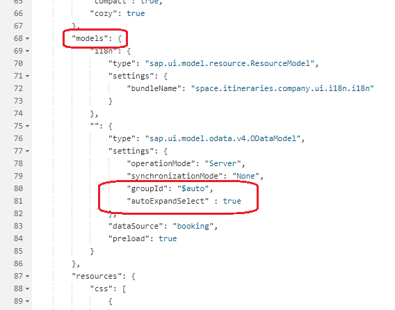 

15. Choose `Service URL` from the tabs on the left. In the dropdown menu, pick the destination that appears in the dropdown menu. Under relative path enter `/` and click on `Test`. The service is now selected and click on `Next`.
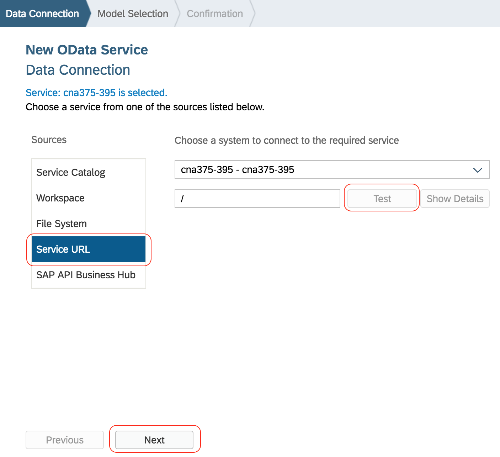 

16. Leave the selection as `Use default model` and click Next.
 

17. Click Finish. Save the manifest.json file. 
 

18. Now right click the `ui` folder and `Run as a Web Application`. 
 

19. Now bookings can be created on this page and on traversing to the next page, the bookings can be viewed.

 


Congratulations. We just built a UI for our Space travel bookings app. In the next exercise we will build and deploy the full-stack application to SAP Cloud Platform.

Click [here](../exercise05/README.md) to continue with Exercise 5.
